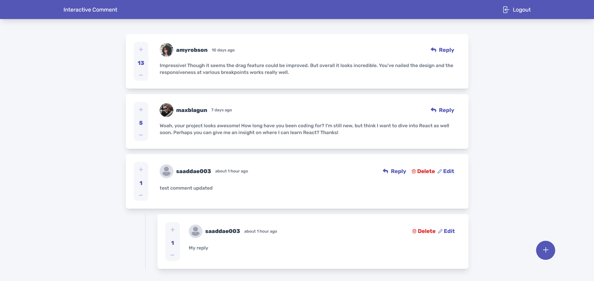
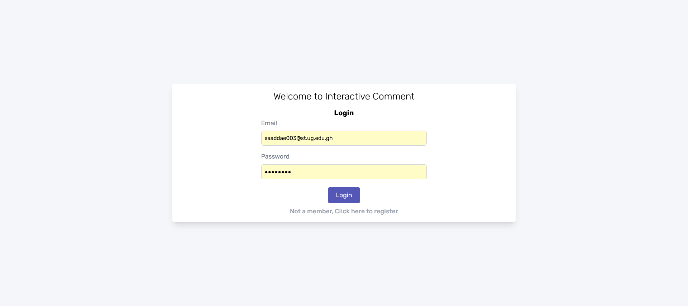
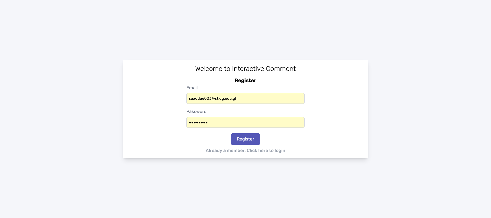
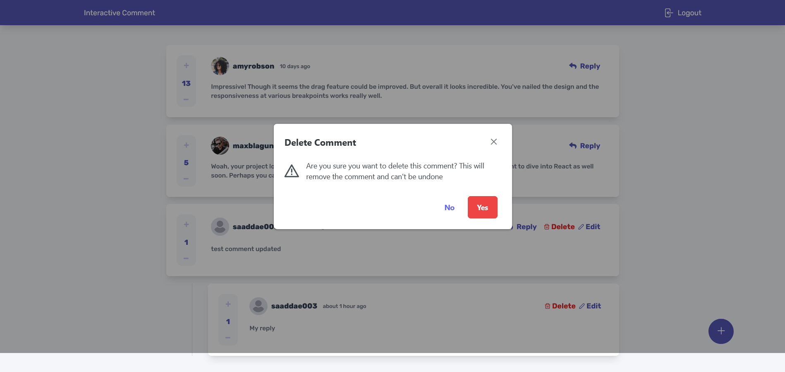
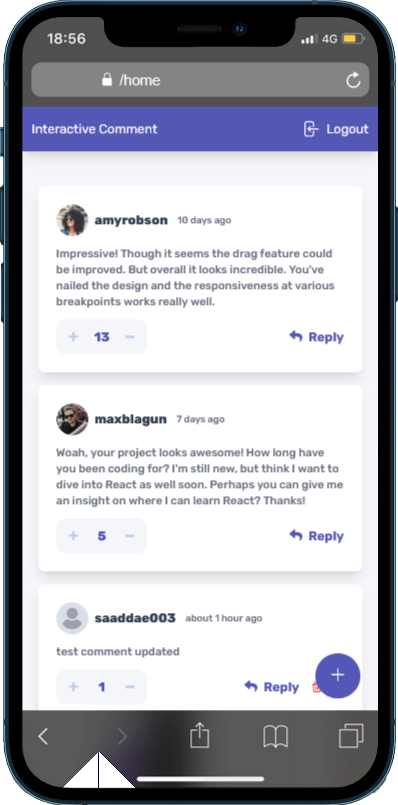

<a name="readme-top"></a>

<div align="center">
  <h1><b>Interactive Comment</b></h1>

</div>

<!-- TABLE OF CONTENTS -->

## 📗 Table of Contents

- [📖 About the Project](#about-project)
  - [Screenshot](#screenshot)
  - [🛠 Built With](#built-with)
    - [Tech Stack](#tech-stack)
    - [Key Features](#key-features)
  - [🚀 Live Demo](#live-demo)
- [💻 Getting Started](#getting-started)
  - [Setup](#setup)
  - [Prerequisites](#prerequisites)
  - [Install](#install)
  - [Usage](#usage)
  - [Run tests](#run-tests)
  - [Deployment](#triangular_flag_on_post-deployment)
- [👥 Authors](#authors)
- [🔭 Future Features](#future-features)
- [🤝 Contributing](#contributing)
- [⭐️ Show your support](#support)
- [🙏 Acknowledgements](#acknowledgements)
- [📝 License](#license)

<!-- PROJECT DESCRIPTION -->

## 📖 Project Overview <a name="about-project"></a>

The interactive comment project is a web-based application that allows users to post and view comments. Built using the React library, Tailwind CSS, PrimeReact, Formik, TypeScript, and Firebase, the project offers a highly responsive and modern user interface. Users can post comments on a topic or article, view comments posted by others, and reply to comments. The application also features real-time updates, so users can see new comments as they are posted. Additionally, Firebase provides a secure backend database for storing comments and user information, ensuring the application is reliable and secure.

### Screenshot

- Deskop View : 
- Login View: 
- Register View: 
- Confirm Delete: 
- Mobile: 

### 🛠 Built With <a name="built-with"></a>

#### Tech Stack <a name="tech-stack"></a>

- Semantic HTML5 markup
- CSS Grid and Flexbox
- Tailwind Css
- Mobile-first workflow
- [React](https://reactjs.org/) - JS library
- [Formik](https://formik.org//) - Forms Validations and Rendering
- [Firebase](https://firebase.google.com/) - For Database
- [Prime React](https://www.primefaces.org/) - For UI Components

<!-- Features -->

### Key Features <a name="key-features"></a>

- **Login Page**
- **Registration Page**
- **Comments Page**
- **Auth Navbar Page**

<!-- GETTING STARTED -->

<!-- LIVE DEMO -->

## 🚀 Live Demo <a name="live-demo"></a>

Here is a link to my project. You can view to show the output so far.

- Solution URL: [Interactive Comment](https://github.com/Stephen-Adom/react-interactive-comment)
- Live Site URL: [Interactive Comment](https://react-interactive-comment-j0mh8izte-stephen-adom.vercel.app/)

# 💻 Getting Started <a name="getting-started"></a>

To get a local copy up and running, follow these steps.

### Prerequisites

In order to run this project you need:

<!--
Example command:

```sh
 gem install rails
```
 -->

### Setup

Clone this repository to your desired folder:

```sh
  cd my-folder
  git clone git@github.com/Stephen-Adom/react-interactive-comment.git
```

-

### Install

Install this project with:

Example command:

```sh
  cd my-project
  npm install
```

-

### Usage

To run the project, execute the following command:

```sh
  npm run start
```

-

### Run tests

To run tests, run the following command:

<!--
Example command:

```sh
  bin/rails test test/models/article_test.rb
```
--->

### Deployment

You can deploy this project using:

<!--
Example:

```sh

```
 -->

<p align="right">(<a href="#readme-top">back to top</a>)</p>

### 👥 Authors <a name="authors"></a>

👤 **Stephen Addae**

- GitHub: [@Stephen-Adom](https://github.com/Stephen-Adom)
- Twitter: [@stephen_alaska](https://twitter.com/stephen_alaska)
- LinkedIn: [Stephen Addae](https://www.linkedin.com/in/stephen-addae-a32334154/)

<!-- FUTURE FEATURES -->

## 🔭 Future Features <a name="future-features"></a>

- [ ] **Post Page Page**
- [ ] **Profile Page**

## 🤝 Contributing <a name="contributing"></a>

Contributions, issues, and feature requests are welcome!

## ⭐️ Show your support <a name="support"></a>

If you like this project, please provide suggestions to help improve this project

## 🙏 Acknowledgments <a name="acknowledgements"></a>

I would also like to thank [Frontend Mentor](https://www.frontendmentor.io/) for providing the project for me to work on

## 📝 License <a name="license"></a>

This project is [MIT](./LICENSE) licensed.

<p align="right">(<a href="#readme-top">back to top</a>)</p>
